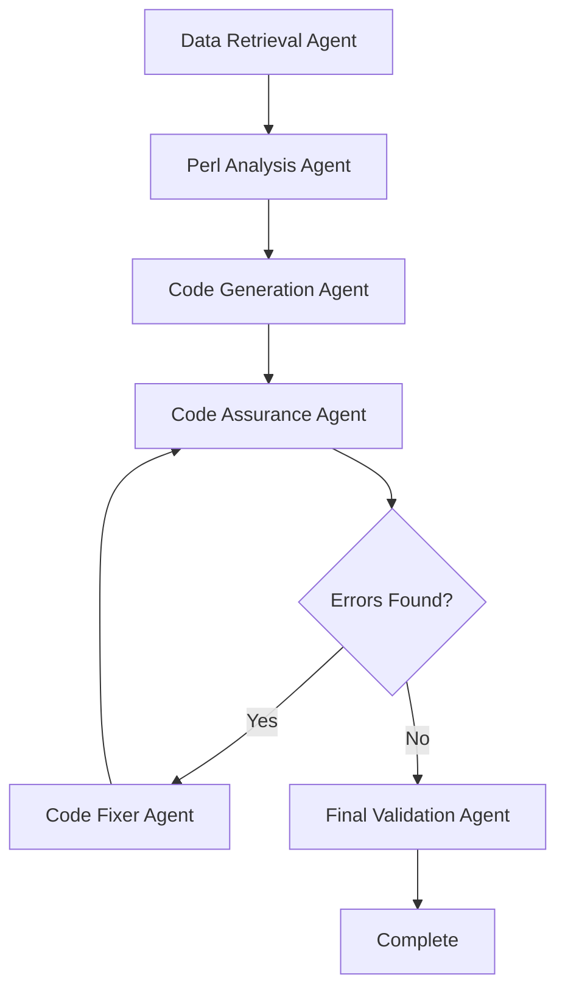

# 🚀 Enhanced Perl-to-Java Converter


This system uses a modular multi-agent architecture with specialized AI agents for different aspects of code conversion:

```
perl-to-java-converter/
├── 📁 Core System
│   ├── main.py              # Main execution orchestrator
│   ├── config.py            # Configuration & enhanced LLM wrapper
│   └── state.py             # State management for agent workflow
├── 📁 Specialized Agents
│   ├── data_agent.py        # Neo4j data retrieval & file handling
│   ├── analysis_agent.py    # Advanced Perl code analysis
│   ├── codegen_agent.py     # Java code generation & fixing
│   └── validation_agent.py  # Quality assurance & optimization
├── 📁 AI Enhancement
│   └── prompts.py           # Enterprise-grade prompt templates
└── 📁 Configuration
    ├── requirements.txt     # Python dependencies
    └── .env                 # Environment configuration
```

## ✨ Key Features

### 🔬 **World-Class Perl Analysis**
- Forensic-level code structure analysis
- Comprehensive subroutine and variable mapping
- Object-oriented pattern detection
- Perl-specific feature identification

### 🏭 **Enterprise Java Generation**
- Production-ready Java class creation
- Modern Java idioms and best practices
- Proper exception handling and type safety
- Design pattern implementation

### 🛠️ **Advanced Error Resolution**
- Multi-layered error diagnosis
- Intelligent code fixing strategies
- Compilation error resolution
- Quality validation and optimization

### 📊 **Comprehensive Reporting**
- Detailed conversion analytics
- Quality metrics and assessments
- Processing time analysis
- Success rate tracking

## 🚀 Quick Start

### 1. Prerequisites

- Python 3.8+
- Neo4j database with Perl AST data
- Groq API key ([Get one here](https://console.groq.com/))

### 2. Installation

```bash
# Clone the repository
git clone <repository-url>
cd perl-to-java-converter

# Install dependencies
pip install -r requirements.txt

# Set up environment
cp .env.example .env
# Edit .env with your configuration
```

### 3. Configuration

Edit `.env` file with your settings:

```env
# Required: Get from https://console.groq.com/
GROQ_API_KEY=your_groq_api_key_here

# Neo4j connection
NEO4J_URI=neo4j://127.0.0.1:7687
NEO4J_USER=neo4j
NEO4J_PASSWORD=your_password

# Output configuration
OUTPUT_DIR=output
```

### 4. Run Conversion

```bash
python main.py
```

## 🔧 Configuration Options

### Core Settings

| Setting | Description | Default |
|---------|-------------|---------|
| `GROQ_API_KEY` | Groq API key for LLM access | Required |
| `GROQ_MODEL` | LLM model to use | `llama3-70b-8192` |
| `NEO4J_*` | Neo4j database connection | localhost:7687 |
| `OUTPUT_DIR` | Output directory for results | `output` |
| `TEMPERATURE` | LLM creativity (0.0-1.0) | `0.1` |
| `MAX_FIX_ATTEMPTS` | Max error fix attempts | `4` |

### Advanced Settings

- **Batch Processing**: Configure `BATCH_SIZE` and `RATE_LIMIT_DELAY`
- **Quality Control**: Set `MIN_CODE_LENGTH` and `OPTIMIZATION_THRESHOLD`
- **Development**: Enable `DEBUG_MODE` and performance logging

## 📋 Agent Workflow

The system uses a sophisticated multi-agent workflow:



### Agent Responsibilities

1. **Data Retrieval Agent** (`data_agent.py`)
   - Fetches Perl code from Neo4j database
   - Reads original source files
   - Structures metadata for analysis

2. **Perl Analysis Agent** (`analysis_agent.py`)
   - Performs comprehensive code analysis
   - Identifies subroutines, variables, and patterns
   - Maps Perl-specific features to Java equivalents

3. **Code Generation Agent** (`codegen_agent.py`)
   - Generates complete Java classes
   - Implements proper Java conventions
   - Creates production-ready code

4. **Code Assurance Agent** (`validation_agent.py`)
   - Validates code quality and structure
   - Identifies compilation issues
   - Performs quality assessments

5. **Code Fixer Agent** (`codegen_agent.py`)
   - Resolves compilation errors
   - Applies intelligent fixes
   - Handles class naming issues

6. **Final Validation Agent** (`validation_agent.py`)
   - Final quality checks
   - Optional code optimization
   - Generates completion reports

## 📊 Output Structure

```
output/
├── success/
│   ├── ConvertedClass1.java
│   ├── ConvertedClass2.java
│   ├── ConvertedClass1_report.json
│   └── ConvertedClass2_report.json
├── failed/
│   ├── FailedFile1_report.json
│   └── FailedFile2_report.json
├── enhanced_conversion_summary.json
└── conversion_summary.txt
```

### Report Contents

Each conversion generates detailed reports including:

- **Success Metrics**: Code length, analysis quality, processing time
- **Quality Assessment**: Readability, maintainability scores
- **Conversion Notes**: Translation insights and recommendations
- **Error Details**: Specific issues and resolution attempts

## 🎯 Advanced Usage

### Custom Prompts

Modify `prompts.py` to customize AI behavior:

```python
# Edit specific prompts for your use case
PERL_ANALYSIS_PROMPT = "Your custom analysis instructions..."
COMPLETE_CLASS_PROMPT = "Your custom generation instructions..."
```

### Environment-Specific Configuration

Create multiple `.env` files for different environments:

```bash
# Development
cp .env .env.dev

# Production
cp .env .env.prod

# Load specific environment
export $(cat .env.dev | xargs)
python main.py
```

### Neo4j Data Requirements

The system expects Neo4j to contain:

- `FILE` nodes with Perl source files
- `PACKAGE` nodes with Perl packages
- `METHOD` nodes with subroutines
- `USE_STATEMENT` nodes with imports
- Proper relationships between nodes

## 🐛 Troubleshooting

### Common Issues

1. **API Rate Limits**
   - Increase `RATE_LIMIT_DELAY` in config
   - Reduce `BATCH_SIZE` for processing

2. **Neo4j Connection Issues**
   - Verify database is running
   - Check connection credentials
   - Ensure proper firewall settings

3. **Memory Issues**
   - Reduce `MAX_TOKENS` setting
   - Process smaller batches
   - Increase system memory

4. **Quality Issues**
   - Review and customize prompts
   - Adjust `TEMPERATURE` setting
   - Enable `DEBUG_MODE` for insights

### Debug Mode

Enable comprehensive debugging:

```env
DEBUG_MODE=true
ENABLE_PERFORMANCE_LOGGING=true
SAVE_INTERMEDIATE_STEPS=true
```

## 📈 Performance Optimization

### For Large Codebases

1. **Parallel Processing**: Increase `BATCH_SIZE` (monitor API limits)
2. **Caching**: Enable intermediate step saving
3. **Selective Processing**: Filter files by complexity
4. **Resource Management**: Monitor memory and API usage

### Quality vs Speed

- **High Quality**: Lower temperature (0.1), more fix attempts
- **Fast Processing**: Higher temperature (0.3), fewer fix attempts
- **Balanced**: Default settings with selective optimization

## 🤝 Contributing

1. Fork the repository
2. Create feature branch (`git checkout -b feature/amazing-feature`)
3. Make changes to appropriate agent modules
4. Add tests for new functionality
5. Commit changes (`git commit -m 'Add amazing feature'`)
6. Push to branch (`git push origin feature/amazing-feature`)
7. Open Pull Request

### Development Guidelines

- Follow the modular agent architecture
- Add comprehensive logging
- Update prompts for new features
- Include error handling
- Document configuration options

## 📄 License

This project is licensed under the MIT License - see the [LICENSE](LICENSE) file for details.

## 🙏 Acknowledgments

- **Groq** for high-performance LLM API
- **Neo4j** for graph database capabilities
- **LangGraph** for agent workflow orchestration
- **Enterprise Perl Community** for conversion insights

---

**🎯 Ready to transform your Perl codebase into modern Java? Get started now!**